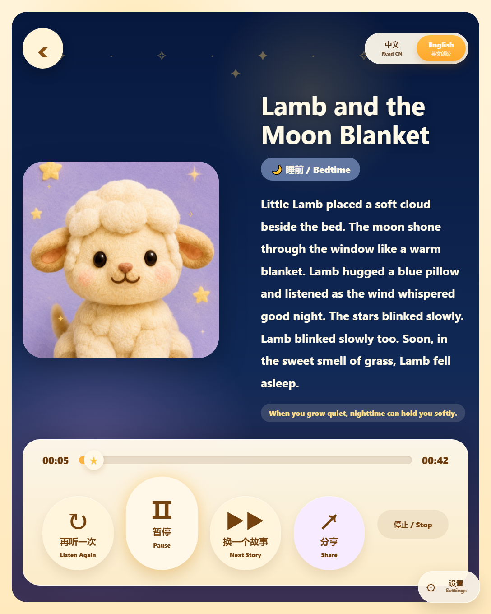
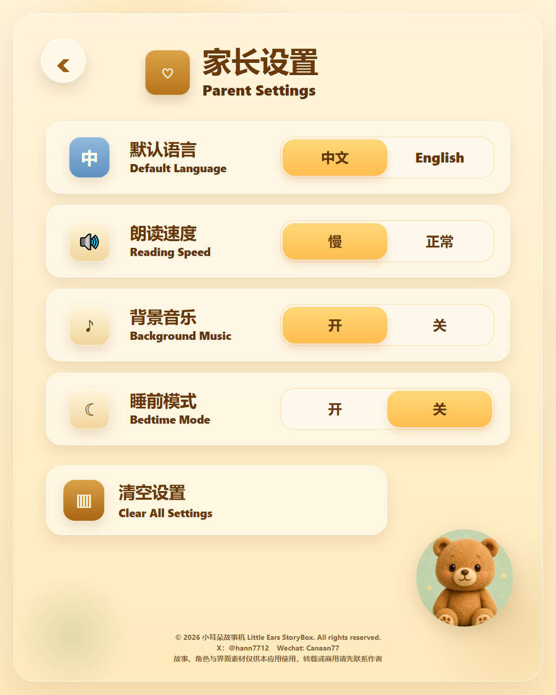

# Little Ears StoryBox | 小耳朵故事机

[English](#english) | [中文](#中文)

---

## English

A gentle bilingual story app for children ages 0-5, with plush-style characters, Chinese and English narration, bedtime mode, sharing, and parent-friendly settings.

[GitHub repository](https://github.com/estherliu-lab/little-ears-storybox) | App URL: `https://estherliu-lab.github.io/little-ears-storybox/`

**Scan to open Little Ears StoryBox**

  

Little Ears StoryBox is made for quiet parent-child listening moments: bedtime, meals, brave little tries, and warm hugs. Children can pick a soft plush-style character, choose Chinese or English, and listen to short stories with matching MP3 narration.

  
  

### What It Does

- Chinese and English interface
- 12 gentle stories for ages 0-5
- Chinese and English MP3 narration for every story
- Soft plush-style character selection
- Playback controls, progress seeking, and language switching
- Bedtime mode, background music, reading-speed settings, and reset
- Share panel with WeChat-friendly copy/share options
- Offline-ready PWA structure

### Who It Is For

This app is designed for families who want short, warm, bilingual stories that are easy to open, easy to listen to, and gentle enough for bedtime routines.

### Updates

Content will continue to be updated with new stories, narration, and visual improvements.

### Copyright

Stories, character assets, UI visuals, audio narration, and related materials are reserved for this project. Please contact the author before reposting, redistributing, adapting, or using them commercially.

Contact:

- X: [@hann7712](https://x.com/hann7712)
- Wechat: `Canaan77`

---

## 中文

小耳朵故事机是一个适合 0-5 岁宝宝的中英文温柔故事应用，包含毛绒风角色、中文/英文配音朗读、睡前模式、分享功能和家长友好的设置页。

[GitHub 仓库](https://github.com/estherliu-lab/little-ears-storybox) | 应用网址：`https://estherliu-lab.github.io/little-ears-storybox/`

**扫码打开小耳朵故事机**

  

小耳朵故事机适合亲子共听、睡前陪伴、吃饭鼓励、勇敢尝试和需要抱抱的温柔时刻。宝宝可以选择喜欢的小动物角色，切换中文或英文，听一段短短的暖心故事。

  
  

### 主要功能

- 中英文界面
- 12 个适合 0-5 岁宝宝的温柔小故事
- 每个故事都有中文和英文 MP3 配音
- 毛绒风小动物角色选择
- 播放、暂停、进度拖动和语言切换
- 睡前模式、背景音乐、朗读速度和清空设置
- 支持微信聊天、朋友圈、系统分享和复制链接的分享面板
- PWA 结构，方便后续离线和安装优化

### 使用场景

适合睡前听故事、亲子共读、宝宝情绪安抚、吃饭鼓励、勇敢练习，以及日常短时间陪伴。

### 持续更新

内容会不断更新，后续会继续加入新的故事、配音、角色和界面优化。

### 版权说明

故事、角色、界面素材、配音音频及相关内容仅供本项目使用。未经作者许可，请勿转载、二次分发、改编或商用。如需转载或商用，请先联系作者。

联系方式：

- X: [@hann7712](https://x.com/hann7712)
- Wechat: `Canaan77`
